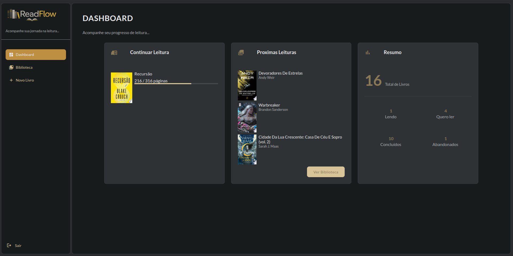
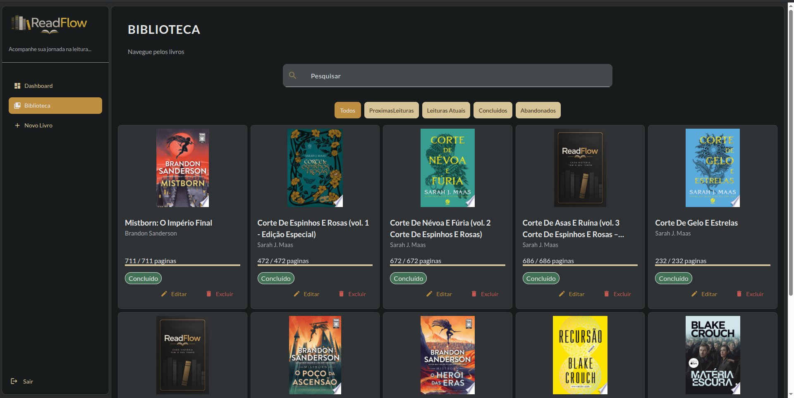
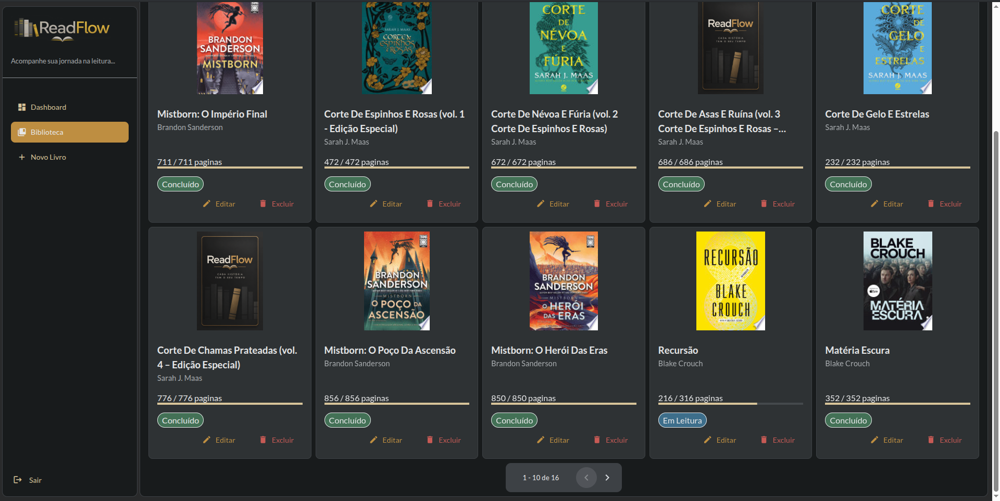
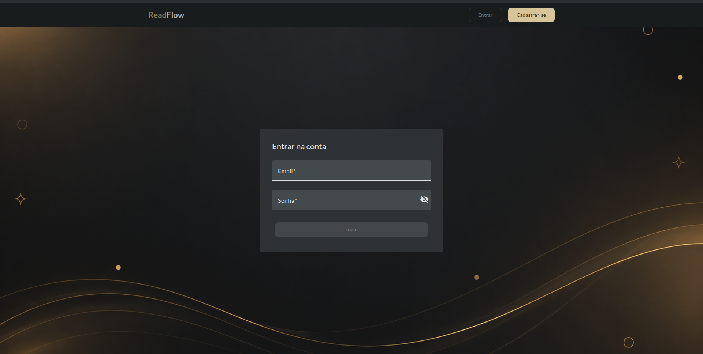

# 📚 ReadFlow — Frontend

**Gerencie suas leituras, acompanhe seu progresso e organize sua biblioteca pessoal em um só lugar.**

O **ReadFlow** é uma aplicação web desenvolvida para ajudar leitores a organizar seus livros, acompanhar o progresso de leitura e planejar suas próximas leituras.

O projeto nasceu da vontade de transformar o acompanhamento de livros em uma experiência simples, intuitiva e personalizada. Além de atender a uma necessidade real, o ReadFlow também representa minha evolução prática no desenvolvimento de software, desde a implementação das regras de negócio até a integração entre frontend, backend e serviços externos.

Este repositório contém o **frontend da aplicação**, desenvolvido com Angular e integrado a uma API REST construída com Java e Spring Boot.

---

## ✨ Funcionalidades

### 🔐 Autenticação e gerenciamento de conta

- Cadastro de usuários com validação de formulários.
- Login com autenticação JWT.
- Confirmação de e-mail por meio de um link enviado ao usuário.
- Reenvio de e-mail de confirmação.
- Proteção de rotas privadas com Angular Guards.
- Inclusão automática do token nas requisições por meio de um HTTP Interceptor.
- Encerramento de sessão e tratamento de erros de autenticação.

### 📖 Biblioteca pessoal

- Cadastro de livros.
- Edição e exclusão de livros cadastrados.
- Visualização das capas e informações das obras.
- Pesquisa de livros na biblioteca pessoal.
- Filtros por status de leitura.
- Acompanhamento das páginas lidas.
- Paginação para navegação entre os livros.

Os livros são organizados em quatro estados:

| Status    | Descrição                      |
| --------- | ------------------------------ |
| Quero ler | Livros planejados para leitura |
| Lendo     | Livros em andamento            |
| Concluído | Livros finalizados             |
| Abandonei | Leituras interrompidas         |

### 🔎 Pesquisa de livros

O ReadFlow permite pesquisar livros utilizando dados da **Google Books API**, por meio da integração realizada pelo backend.

Ao selecionar um resultado, o formulário pode ser preenchido automaticamente com informações como:

- Título.
- Autor.
- Capa.
- Quantidade de páginas, quando disponível.

O usuário pode revisar e corrigir as informações antes de cadastrar o livro.

Também é possível adicionar livros manualmente, sem utilizar a pesquisa externa.

### 📊 Dashboard de leitura

O Dashboard apresenta um resumo da biblioteca pessoal, incluindo:

- Livros em leitura.
- Próximas leituras.
- Total de livros cadastrados.
- Quantidade de livros por status.
- Progresso de leitura em páginas.

---

## 🖼️ Demonstração da aplicação

### Dashboard

Visão geral das leituras, progresso e estatísticas da biblioteca pessoal.



### Biblioteca

Visualização dos livros cadastrados, com capas, status, progresso e opções de gerenciamento.



### Paginação

Navegação entre os registros da biblioteca por meio de páginas, com suporte à paginação fornecida pelo backend.



### Pesquisa externa de livros

Pesquisa integrada ao Google Books, permitindo localizar obras antes de adicioná-las à biblioteca.


### Cadastro automático de livros

Preenchimento de informações a partir do resultado selecionado na pesquisa externa.


### Login

Tela de autenticação para acesso à biblioteca pessoal.



### Cadastro de usuário

Formulário para criação de uma nova conta.


### Verificação de e-mail

Após o cadastro, o usuário recebe orientações para confirmar seu endereço de e-mail.


### Confirmação de e-mail

Tela exibida após a validação bem-sucedida do link de confirmação.


---

## 🛠️ Tecnologias utilizadas

| Tecnologia          | Utilização                                     |
| ------------------- | ---------------------------------------------- |
| Angular 19          | Framework principal do frontend                |
| TypeScript          | Linguagem de programação                       |
| Angular Material 19 | Componentes de interface                       |
| SCSS                | Estilização da aplicação                       |
| RxJS                | Tratamento de operações assíncronas            |
| Angular Signals     | Gerenciamento de estados reativos              |
| Angular Router      | Navegação e proteção de rotas                  |
| HttpClient          | Comunicação com a API REST                     |
| HTML                | Estrutura das interfaces                       |
| Git e GitHub        | Versionamento e organização do desenvolvimento |

---

## 🏗️ Organização do projeto

O frontend utiliza componentes standalone e uma organização baseada nas responsabilidades de cada parte da aplicação.

A estrutura principal segue esta divisão:

```text
src/
└── app/
    ├── core/
    │   └── service/
    ├── features/
    │   ├── dashboard/
    │   ├── books/
    │   ├── create-book/
    │   ├── login/
    │   ├── register/
    │   └── confirm-email/
    ├── layout/
    └── shared/
```

**Core:** concentra serviços e funcionalidades compartilhadas, como autenticação, comunicação com a API e verificação de disponibilidade do backend.

**Features:** organiza as funcionalidades da aplicação, mantendo as responsabilidades de cada tela separadas.

**Layout:** contém a estrutura visual compartilhada, incluindo a navegação da área autenticada.

**Shared:** reúne modelos, enums e outros elementos reutilizáveis.

Essa organização busca facilitar a manutenção, a compreensão do código e a evolução do projeto.

---

## 🔗 Integração com o backend

O frontend se comunica com uma API REST desenvolvida com **Java 21 e Spring Boot**, responsável pelas regras de negócio, autenticação, persistência dos dados e integração com o Google Books.

O backend utiliza:

- Spring Boot.
- Spring Security e JWT.
- Spring Data JPA.
- PostgreSQL.
- Google Books API.
- Serviço de envio de e-mails.

A comunicação é realizada por requisições HTTP.

### Autenticação das requisições

Após o login, o token JWT é armazenado no `sessionStorage`.

Um interceptor HTTP adiciona o token às requisições autenticadas, enquanto os Guards controlam o acesso às rotas privadas.

A validação efetiva do token e das permissões é realizada pelo backend.

### Disponibilidade do servidor

A aplicação também consulta um endpoint de saúde do backend para identificar sua disponibilidade.

Isso permite apresentar estados de carregamento e mensagens apropriadas quando o servidor ainda está iniciando ou não está disponível.

---

## 🚀 Como executar localmente

### Pré-requisitos

Para executar o frontend, é necessário ter instalado:

- Node.js compatível com Angular 19.
- npm.
- Git.
- Backend do ReadFlow configurado e em execução.

### 1. Clonar o repositório

```bash
git clone <https://github.com/RamonCoost/ReadFlow-front>
```

Acesse a pasta do projeto:

```bash
cd ReadFlow-front
```

### 2. Instalar as dependências

```bash
npm install
```

### 3. Configurar a comunicação com a API

Antes de iniciar a aplicação, verifique a configuração da URL do backend utilizada pelos serviços Angular.

No ambiente local, o backend normalmente é executado em:

```text
http://localhost:8080
```

O backend deve estar configurado para permitir requisições da origem do frontend.

### 4. Iniciar a aplicação

```bash
npm start
```

Caso prefira utilizar diretamente o Angular CLI:

```bash
npx ng serve
```

A aplicação poderá ser acessada em:

```text
http://localhost:4200
```

### 5. Gerar uma versão de produção

```bash
npm run build
```

Os arquivos gerados serão disponibilizados na pasta de saída configurada pelo Angular.

---

## 🔒 Segurança

O ReadFlow utiliza autenticação JWT para proteger o acesso aos dados dos usuários.

No frontend, foram implementados mecanismos como:

- Proteção de rotas privadas.
- Envio automático do token JWT.
- Tratamento de respostas HTTP 401.
- Remoção do token ao encerrar a sessão.
- Validação de formulários.
- Fluxo de confirmação de e-mail.

As regras de autorização e a proteção dos dados são responsabilidades do backend.

---

## 📌 Melhorias futuras

O ReadFlow continua em evolução. Entre as funcionalidades planejadas estão:

- Sistema de avaliação dos livros por estrelas, permitindo classificações de 1 a 5 estrelas.
- Novas estatísticas e indicadores de leitura.
- Melhorias na precisão e no tratamento das informações recebidas da API externa.
- Evolução dos recursos de gerenciamento da biblioteca.

---

## 👨‍💻 Sobre o desenvolvimento

O ReadFlow é um projeto pessoal desenvolvido para aplicar e aprofundar conhecimentos em Engenharia de Software.

Durante seu desenvolvimento, foram trabalhados conceitos como:

- Desenvolvimento de interfaces com Angular.
- Consumo de APIs REST.
- Autenticação e gerenciamento de sessões.
- Programação reativa.
- Organização de componentes e serviços.
- Integração entre frontend e backend.
- Tratamento de erros e estados de carregamento.
- Versionamento com Git e GitHub.
- Desenvolvimento incremental de funcionalidades.

Mais do que um exercício acadêmico, o ReadFlow é uma aplicação construída a partir de necessidades reais, decisões técnicas e aprendizado contínuo.

---

## 📄 Licença

Consulte as informações de licença do repositório, quando disponibilizadas.

---

**ReadFlow — Acompanhe sua jornada na leitura.** 📚
